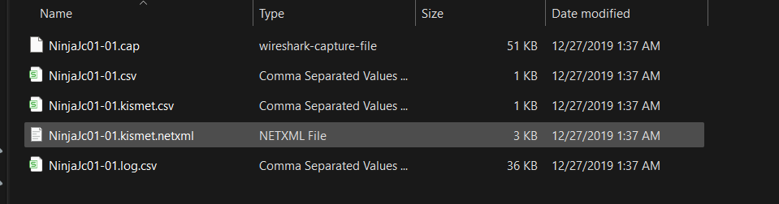

## Task 1 - Introduction of WPA

**Key terms:**

- `SSID`: the network name that see when trying and connecting
- `ESSID`: an SSID that can apply to multiple access points ⇒ bigger network. For Aircrack, they refer to the network is be attacking
- `BSSID`: an access point MAC (hardware) address
- `WPA2-PSK`: wifi networks that connecting to by providing a pre-shared password that’s the same for everyone
- `WPA2-EAP`: wifi networks that authenticating to by providing a username and password, which is sent to RADIUS server
- `RADIUS`: a server for authenticating clients, not just for wifi

**The core of WPA(2) authentication is the 4 ways handshake**

### 1. The core 
- Mutual Authentication: Both the Client and the AP prove to each other they know the password without actually revealing it
- Key Generation: Pairwise Transient Key (PTK) - a unique, one-time encryption key used to scramble your data for that specific session

**The 4-WHS Process**
    
Before this starts, both sides have already calculated a PMK using your password and ESSID

| **Step** | **Direction** | **What happens?** |
| --- | --- | --- |
| **Step 1** | **AP → Client** | The AP sends a random number called **ANonce** |
| **Step 2** | **Client → AP** | The Client creates its own random number (**SNonce**) and calculates the PTK. It sends the SNonce and a **Message Integrity Check (MIC)**-a digital signature proving it has the right password. |
| **Step 3** | **AP → Client** | The AP calculates the PTK using the SNonce. If the signatures match, the AP is convinced the Client is legit. It then sends the **Group Temporal Key (GTK)** for broadcast traffic. |
| **Step 4** | **Client → AP** | The Client confirms that the keys are installed. From this microsecond forward, all data is encrypted. |
    
**Note:**
    
- PSK (Pre-Shared Key): the Wifi password
- ANonce: a random number generated by the Router (AP)
- SNonce: a random number generated by the Device (Client)
- PTK (Pairwise Transient Key): the encryption key for the data. It is calculated locally by both sides using: Password + ANonce + SNonce + MAC address
- MIC (Message Integrity Check): A digital signature used to verify that the password is correct and ensure the data hasn’t been tampered with

### 2. The role of the ESSID 

In cryptography, a Salt is random data added to a password before hashing it. in WPA2, the ESSID acts as a Salt

The formular of the Master Key look as this:

$$
PMK = PBKDF2(Passphrase, ESSID, 4096, 256)
$$

**WPA2 vs the “Broken” WEP**

| WEP (Wired Equivalent Privacy) | WPA2: |
| --- | --- |
| Used a static key, if gathering enough packets (statical analysis), the key eventually revealed itself cuz it repeated patterns | Used the 4-WHS to ensure that even if using the same password for 10 years, the PTK changes every single time which reconnect |

**The Weakness of Offline Cracking**

The hacker can capture all four packets of a successful handshake process and then they can run a Dictionary Attack offline ⇒ guess the password by brute force 

## Task 2 - Capturing packets to attack

The primary goal of this attack to capture the 4 - way handshake. And then we can attempt to crack the password by wordlist (brute force)

**The aircrack-ng suite consists of:**

- aircrack-ng
- airdecap-ng
- airmon-ng
- aireplay-ng
- airodump-ng
- airtun-ng
- packetforge-ng
- airbase-ng
- airdecloak-ng
- airolib-ng
- airserv-ng
- buddy-ng
- ivstools
- easside-ng
- tkiptun-ng
- wesside-ng

The aircrack tools come by default with Kali, or can be installed with a package manager or from [https://www.aircrack-ng.org/](https://www.aircrack-ng.org/)

**Step 1**: Enable Monitor mode

By default, the NIC only “listens”, so enable monitor mode allow it can “sniff” every packet in the air

- Command: `airmin-ng start wlan0`
- Key Detail: after running this, the interface name usually changes (wlan0 → wlan0mon). Should running `airmon-ng check kill` first to stop background processes that might interfere
- Step 2: Network Reconnaissance

Scanning the area to identify the target network before and see who is connected to it

- Command: `airdump-ng wlan0mon`

**Step 3**: Targeted Capture

Once we have the BSSID and Channel, we need to focus the NIC on that specific target to capture the handshake file

- Command: `airodump-ng -c [channel] --bssid [BSSID] -w [filename] wlan0mon`
- Purpose: telling card to stay on a channel and save all intercepted data into a `.cap` file

**Step 4**: The Deauthentication Attack

Using Packet Injection to kick a current user off the network. Their device will automatically try to reconnect

- Command: `aireplay-ng -0 5 -a [BSSID] wlan0mon`
- Logic: `-0` → deauth attack, 5 → number of deauth packets sent

**Step 5**: Offline Cracking

Using CPU/GPU to compare the handshake against a list of  possible passwords

- Command: `aircrack-ng -w /urs/share/wordlists/rockyou.txt [filename-01.cap]`

## Task 3 - Practice
The task file for practice can be downloaded from the provided 

<a href="NinjaJc01-01.cap" download>[Download] wifi101.tar.gz</a>

After downloading and extracting the archive, five different files are obtained, as shown in the figure like this

In this task, we focus on the file `NinjaJc01-01.cap`, while the remaining files contain reconnaissance logs

The analysis is performed using Ubuntu on Windows via WSL. To crack the captured handshake, the following command is used:
`aircrack-ng -w [path_to_rockyou.txt] [path_to_NinjaJc01-01.cap]`

After a few seconds, Aircrack-ng successfully recovers the WPA password

The cracked password for the network **“James Honor 8”** is:

greeneggsandham

